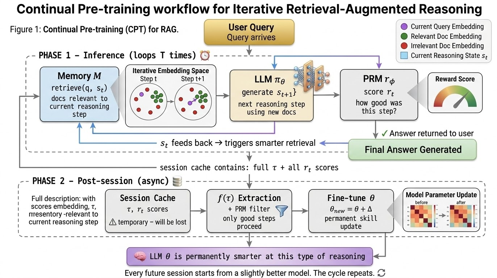

> **why we need to care about this**

Current LLMs excel at pattern recognition and fluent generation, but treat knowledge and reasoning as structurally isolated, facts frozen in weights, reasoning trajectories discarded after every session. This architectural separation leads to persistent failures in **multi-step reasoning**, **attribution**, and **hallucination**. Effective intelligent behavior, as this [work](https://dl.acm.org/doi/abs/10.1016/j.compedu.2025.105357) argues, emerges from the interaction between knowledge and skills, not either alone. Motivated by this, we distinguish LLMs from human memory and cognition through structural analogies, and build a [CLS](https://pubmed.ncbi.nlm.nih.gov/22141588/)-based AI system grounded in what is actually happening inside current LLMs.

## Human Memory as Structured Computation
Human reasoning is not independent of memory, it is constrained by it. Cognitive science formalizes memory as a three-stage system: encoding, consolidation, and retrieval. Information enters through perception, is temporarily held in short-term memory, and, if properly encoded, is transferred into long-term memory through a process called **consolidation**. during this process physical traces of memory leaves when groups of neurons strengthen their connections during learning called **engrams**. These engrams integrate new information into existing **mental frameworks (schemata)** through repeated re-consolidation of knowledge, which are essential for processing knowledge and critical thinking [Oakley et al., 2025](https://arxiv.org/abs/2506.11015). 

Human memory divides into 3 fundamentally different systems:

**Sensory Memory** — High-bandwidth, short-lived buffering of perceptual input.

**Short-Term Memory (Working Memory)** — Capacity-limited workspace for active manipulation.

**Long-Term Memory** — Durable storage, divided into:
- **Declarative Memory**: Explicit, addressable knowledge (facts, events, concepts).
- **Procedural Memory**: Implicit skill policies refined through feedback and repetition.

Through **re-consolidations**, declarative structures and procedural policies become tightly integrated, enabling knowledge to guide execution and execution to refine knowledge. This **bidirectional stabilization** constitutes the core mechanism of human cognition for adaptive intelligence [Sridhar et al., 2023](https://pubmed.ncbi.nlm.nih.gov/37565054/) serves as benchmark for general intelligence.

## LLM Memory as Computational Analogs

### Parameters → Skill / Procedural Competence at Language Generation
LLM parameters already functioning as **procedural competence at language generation**. As language generation is unconscious if we have knowledge on it, and here in LLM this is achieved through loss-optimized next-token prediction policies that internalize statistical regularities of syntax and reasoning over language data, mediated by [Transformer self-attention](https://arxiv.org/abs/1706.03762]) over hierarchical context, enabling emergent structured reasoning behavior [Brown et al., 2020](https://arxiv.org/abs/2005.14165]), without addressable factual storage, source attribution, or explicit declarative recall mechanisms.

### External Memory → Declarative Knowledge
External memory systems (e.g., RAG, [HippoRAG](https://arxiv.org/abs/2405.14831)) function as **computational declarative memory**. They provide explicit, addressable, and persistently indexed factual representations retrieved at inference time, architecturally separated from parametric skill execution, thereby enabling stable, updateable, and consciously conditionable knowledge access without modifying model weights.

So if parameters handle skills and external memory handles facts, what's the problem? Well, knowing facts doesn't automatically make you a good reasoner. A medical student can memorize textbooks but still struggle with diagnosis. That's where the next frontier lies: teaching models *how to think* and this can be inducing reasoning knowledge. 

## How to Incorporate Procedural Competence at Reasoning Tasks

Unconsciously, [Procedural Knowledge in Pretraining Drives Reasoning in Large Language Models](https://arxiv.org/abs/2411.12580) demonstrates that reasoning performance primarily arises from **procedural patterns acquired during pretraining**, indicating that LLM parameters encode generalizable solution strategies as **unconscious skills** rather than explicit factual recall.

> from pre-training we get procedural knowledge created in LLM parameters, to make it good reasoner we need to incorporate reasoning knowledge in LLMs, making it purely uncouncious procedural memory

**Parameter-updated Procedural Encoding**: Methods like SFT, RL with PRM / PPO resulting [AgentPRMs](https://arxiv.org/abs/2502.10325), RLHF/RLAIF, and DPO directly train on trajectories or preferences so that LLM weights internalize preferred multi-step reasoning strategies as procedural skills. 

Broadly speaking, recently these process reward models (PRMs) are incorporating reasoning in 2 ways,

1. **Parameter-updated through PRMs** : A separate reward model evaluates intermediate reasoning trajectories and supplies step-wise scalar feedback, enabling reinforcement learning to update base LLM parameters. This embeds preferred reasoning policies directly into weights, strengthening procedural strategies without introducing explicit declarative content. [Survey paper](https://arxiv.org/abs/2510.08049)

2. **External Procedural Memory** : A separate reward model stores reasoning trajectories, skills, or instructions as entities in external memory, enabling the model to retrieve/reuse them at inference time without retraining parameters. The base LLM can be fixed or lightly adapted, but the key reasoning improvement comes from the memory system. [TokMem](https://arxiv.org/abs/2510.00444) [LEGOMem](https://arxiv.org/abs/2510.04851) [Memp](https://arxiv.org/abs/2508.06433)

## Building the Unified Framework for Reasoning through knowledge extracted in LLMs

Now lets concentrate on building that expected unified framework for skills in LLM parameters work as a unconscious (procedural memory) calling out reasoning strategies over external memory work as a conscious (declarative memory) retriveal from RAG.

Example: Think of how a doctor learns. They read a paper, that updates their knowledge. They treat a patient using that knowledge, that refines their skill. And the skill feeds back, sharpening how they even recall the knowledge. Both directions, continuously, naturally.

> LLMs can't do this. At inference, weights are frozen. A retrieved fact can influence an output, but it cannot reshape how the model reasons. A completed reasoning chain disappears the moment the session ends. The two systems knowledge and skill, never actually touch. Making them do so mid-inference would require rewriting weights on a live network. At scale, that's catastrophic interference waiting to happen. The architecture simply doesn't allow it.

So instead of forcing something the architecture can't support, we look to what biology actually solved. In 1995, [McClelland et al.](https://pubmed.ncbi.nlm.nih.gov/22141588/) described exactly this problem and the brain's answer to it is...

### The Complementary Learning Systems theory 

Complementary learning systems theory says hippocampus rapidly stores new episodes, then replays them so neocortex can slowly extract general structure, integrating new information without overwriting existing knowledge.

1. New experience → Hippocampus quickly stores a flexible episodic memory without disturbing existing knowledge.

2. Many episodes → Neocortex slowly extracts shared structure, forming stable, generalized long‑term knowledge.

3. Later (especially sleep) → Hippocampus replays important episodes, training neocortex and consolidating selected memories.

> Why we need this CLS based AI systems?
>
> Current LLMs throw away users’ hard-won reasoning trajectories; capturing and consolidating those trajectories would turn each successful human–AI interaction into reusable reasoning skill for future tasks. In this way we can make LLMs learn from humans cognitive reasoning strategies, towards a specific answer. 

This architecture is an initial concept to be developed further. For detailed examples and progress, view this [link](https://github.com/RavitejaBommireddy/Complementary-Learning-Systems-in-LLMs)

## Phase 1 : Unification

### Reasoning-guided retrieval (RGR)

Core : Initial retrieval based on question is not enough, Need to Start retrieving from every where you are in the reasoning chain.

- This approach will be stronger than Standard RAG, where they only retrieves once from the initial query. 
$$
d_i = R(q)
$$
- Current state-of-the-art RAG trends are “Agentic” multi-step systems (e.g., ReAct-style, GraphRAG, routing RAG), but most still lack tightly coupled state-conditioned retrieval with updating models context.
- After every reasoning step, **"Embed q + s_t"** into one vector (eg: [RAT](https://arxiv.org/abs/2403.05313)), capturing what specifically needed. Then do the retrieval as 
$$
d_i = R(q + s_t)
$$
- find the most similar (top‑k) documents and add them to the model’s context, making a loop as better state → better docs → better next state.

### PRM-guided consolidation

Core : Score every reasoning step. Keep only the best. Write them into model weights.

- From the previous RGR, we produce the complete reasoning trajectory with sequence of all reasoning steps  as a learning signal
$$
τ = (s_1, s_2, ..., s_T)  
$$
- We now have something concrete to evaluate: not just the answer, but every step that led to the final answer. 
- Now, with PRM's Score each intermediate step for correctness. where this PRM is trained separately on step-level human annotations.  [Survey paper](https://arxiv.org/abs/2510.08049)
- Now, filter and consolidate only high-quality trajectories to update θ (LLM parameters), Discard the low quality once.
- Threshold filter: keep τ if R(τ) ≥ threshold. Run policy gradient to increase probability of those reasoning strategies.
$$
\text{if } R(\tau) \geq \text{threshold:} \quad
\theta \leftarrow \theta + \alpha \, \nabla_\theta \mathbb{E}\Big[\sum r_t \Big]
$$

- Model weight θ now encode verified reasoning patterns. Resulting, better reasoning in all future sessions. 

## Phase 2 : Consolidation

Core : Before it disappears, extract the useful reasoning from it and update θ permanently.

- Phase 2 starts after the session ends: it treats the whole session cache (query, docs, trajectory, PRM scores) as “sleep replay” material, not as online RL signal
- An extraction function f(τ) turns the raw trajectory into structured reasoning artifacts (patterns, sub‑plans, known failure modes) that are easier to generalize across future relevent tasks.
- PRM scores act as a gate: only artifacts coming from high‑scoring steps become A_good, ensuring only verified reasoning patterns are allowed to influence the weights.
$$
A\_good = \{ a \text{ from } f(\tau) \mid r_\phi(s_\text{source}) \ge \text{threshold} \}
$$
- The LLM is then fine‑tuned on A_goodas supervised data, so temporary in‑context reasoning becomes a permanent capability in θ, while the original session cache is discarded.

## Outcomes

- Phase 1 of RGR provides documents for every reasoning step in that trajectory. 
- Phase 1 PRM guided consolidation Uses, many full trajectories across sessions, with PRM rewards, to do RL-style policy updates on entire reasoning strategies
- Phase 2 Uses one finished session’s cache, extracts structured patterns f(τ), PRM-filters them, and fine‑tunes θ with supervised learning on those distilled artifacts

- This AI-CLS mirrors biological CLS by pairing a fast, episodic external memory M with slow, generalized parameter updates θ, plus a replay-like Phase 2 that selectively consolidates high-quality session reasoning, though neural-level attention and interference-safe forgetting remain only partially captured.

> Why this matters?
>
> If AI-CLS works, we get LLMs that actually learn from real-world use, every high-quality, PRM‑validated reasoning session becomes reusable skill in the weights, shrinking hallucinations and enabling gradual, domain-specific expertise without full retraining.